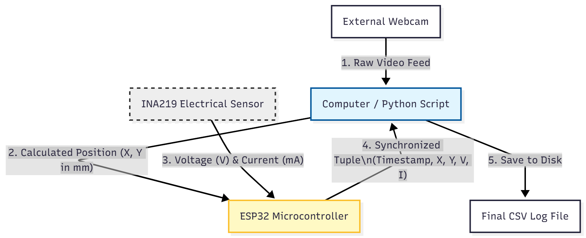
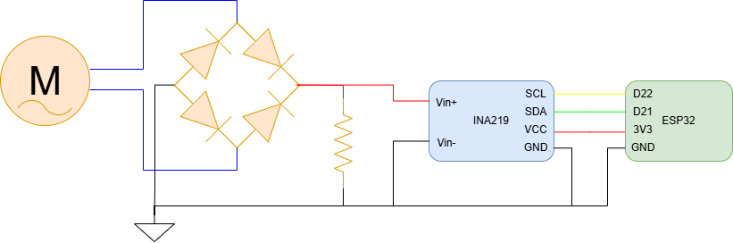

# Synchronized Data Acquisition for Wave Energy Converter

## 🌊 Project Overview
**Role:** Electronics & Control Lead (Capstone Project)
**Context:** Renewable Energy from Ocean Waves (Point Absorber Prototype)

This project implements a high-precision Data Acquisition System (DAQ) to validate the efficiency of a wave energy converter. The system synchronizes mechanical data (Computer Vision) with electrical telemetry (Voltage/Current) to generate accurate power curves.

## 🛠️ The Challenge: OS Latency
To measure the generator's efficiency ($\eta = P_{elec} / P_{mech}$), we needed to correlate the buoy's movement with the power output.
* [cite_start]**Problem:** Using Windows OS to timestamp high-frequency sensor data introduced variable latency (drift), making precise synchronization impossible[cite: 41, 45].
* **Consequence:** Data skews rendered the mechanical-to-electrical efficiency models invalid.

## 💡 The Solution: Hardware "Time Master"
[cite_start]I designed a closed-loop architecture where the **ESP32 Microcontroller acts as the Time Master**, bypassing the OS scheduler entirely.

1.  **PC (Python):** Tracks markers via webcam and sends position $(X, Y)$ to the ESP32.
2.  **ESP32 (C++):** Waits for the position packet.
3.  **Hardware Sync:** Upon reception, the ESP32 *immediately* triggers the electrical sensor reading (INA219).
4.  [cite_start]**Data Return:** The ESP32 packages the synchronized tuple `(Timestamp, X, Y, V, I)` and sends it back to the PC for logging[cite: 48, 49, 50, 51].

### System Architecture

*(Figure: Data flow ensuring <10ms synchronization delay)*

## ⚙️ Key Technical Features

### 1. Dynamic Calibration Algorithm
Hardcoding a pixel-to-mm ratio is error-prone due to camera vibrations. [cite_start]I implemented a **per-frame calibration** system using a 3-marker setup[cite: 67, 68]:
* **Reference Markers (ID 10 & 11):** Placed at a fixed known distance.
* [cite_start]**Algorithm:** The script recalculates the scale factor ($mm/px$) for every single frame based on the distance between Ref 1 and Ref 2[cite: 74, 75].
* [cite_start]**Result:** Robust measurement accuracy ($\pm$ 0.5 mm) even if the camera focus or position shifts slightly[cite: 83].

### 2. Electrical Hardware Setup
* [cite_start]**Microcontroller:** ESP32-DevKitC (Dual-core, High speed)[cite: 88].
* [cite_start]**Sensor:** INA219 (High-Side DC Current/Voltage) over I2C[cite: 89, 90].
* **Power Stage:** Full-bridge rectifier connecting the generator to the load.

## 💻 Tech Stack
* **Embedded:** C++ (Arduino Framework), Serial Communication (115200 baud).
* **Computer Vision:** Python, OpenCV (ArUco Dictionary), NumPy.
* **Protocols:** UART (Serial), I2C.

## 🚀 How to Run
*(Detailed operational guide available in `docs/Report.pdf`)*

1.  **Hardware:** Connect ESP32 via Data USB. Ensure markers 10, 11, and 12 are visible.
2.  **Software Sequence:**
    * [cite_start]Close any open Serial Monitors (Arduino IDE) to free the COM port[cite: 136].
    * Run the script: `python calibrated_logger.py`
    * [cite_start]Wait 4 seconds for buffer cleaning[cite: 140].
3.  [cite_start]**Output:** Data is saved to `log_experience_YYYYMMDD.csv` for MATLAB/Excel analysis[cite: 146].

---
*Full Engineering Report available in the `docs/` folder.*
